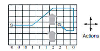
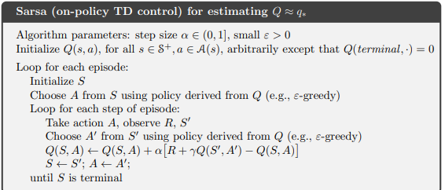

# Windy Gridworld with Temporal Difference (TD) Reinforcement Learning

## Overview

The ultimate goal of the task is to find the fastest path from the start to the finish cell on a rectangular grid. The environment includes an artificial wind on some fields, which moves the agent in a specified direction. The solution is an implementation of SARSA as an on-policy TD control.

## Windy Gridworld - Description

Shown below is a standard gridworld with start and goal states, but with one difference: there is a crosswind running upward through the middle of the grid. The actions are the standard four—up, down, right, and left—but in the middle region, the resultant next states are shifted upward by a “wind,” the strength of which varies from column to column. 

The strength of the wind is given below each column, in number of cells shifted upward. For example, if you are one cell to the right of the goal, then the action left takes you to the cell just above the goal. This is an undiscounted episodic task, with constant rewards of -1 until the goal state is reached.

## Implementation Details

The graph to the right shows the results of applying SARSA (on-policy TD control) to this task, with epsilon = 0.1, alpha = 0.5, and the initial values Q(s, a) = 0 for all s, a. The increasing slope of the graph shows that the goal was reached more quickly over time. By 8000 time steps, the greedy policy was long since optimal (a trajectory from it is shown inset); continued epsilon-greedy exploration kept the average episode length at about 17 steps, two more than the minimum of 15. 

Monte Carlo methods cannot easily be used here because termination is not guaranteed for all policies. If a policy was ever found that caused the agent to stay in the same state, then the next episode would never end. Online learning methods such as SARSA do not have this problem because they quickly learn during the episode that such policies are poor and switch to something else.

## Parameters Used

- **Epsilon (ε)**: 0.1
- **Alpha (α)**: 0.5
- **Initial Q-values (Q(s, a))**: 0 for all states and actions

## Results

The goal was reached more quickly over time with the epsilon-greedy SARSA algorithm. By 8000 time steps, the greedy policy was optimal, and continued epsilon-greedy exploration kept the average episode length at about 17 steps, which is close to the minimum of 15 steps.

This approach ensures that the agent learns to navigate the windy gridworld efficiently, avoiding the pitfalls that can occur with other methods such as Monte Carlo.

# Algorithm

